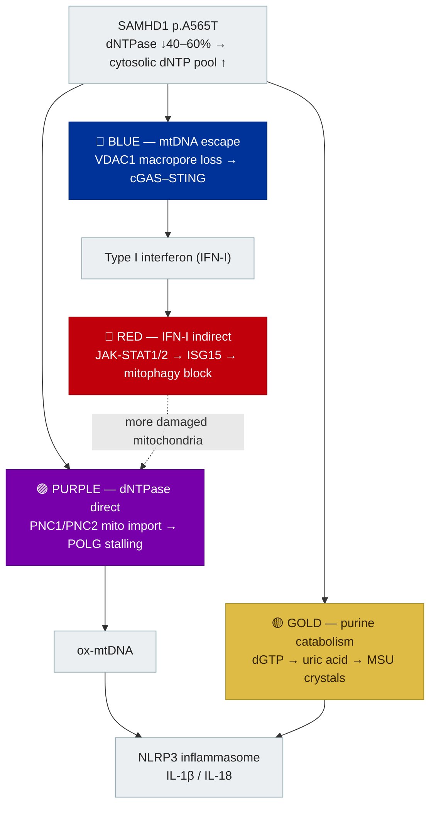

# The pathway map

Every research-blog post is tagged with one or more of the mechanistic
categories used below (`NLRP3`, `VDAC1`, `cGAS-STING`, `JAK-STAT`, and so on).
This page is the glossary: what each pathway is, and which of four
color-coded streams it belongs to in the working disease model.

The same four streams drive the weekly literature screen — a paper is scored
against this exact framework before it's added to the digest.

## One root cause, four streams

*SAMHD1* p.A565T leaves roughly 40–60% residual dNTPase activity, so the
cytosolic dNTP pool — especially dGTP — runs high. That single upstream event
branches into four largely independent streams, two of which converge on the
**NLRP3 inflammasome** and two of which converge on **type I interferon**.

!!! note "Two parallel loops, not one sequence"
    NLRP3 and IFN-I are activated by **two different molecular species**
    escaping the mitochondrion in parallel, not one after the other:
    oxidized mtDNA (from stalled replication) feeds NLRP3, while
    unoxidized cytosolic mtDNA fragments (escaping through the VDAC1
    macropore) feed cGAS-STING. Blocking one route does not shut down the
    other — which is the mechanistic argument for why a single drug class
    (e.g. a JAK inhibitor, which only addresses the IFN-I side) leaves a
    residual disease floor. See [The Science](samhd1.md#the-mechanism-one-root-cause-four-streams)
    for the clinical implications.

---

## 🟣 Purple stream — dNTPase direct { #purple }

**Blog categories:** { #dntpase }`dNTPase`, { #polg-mtdna }`POLG-mtDNA`,
{ #mito-dntp-transport }`mito-dNTP-transport`,
{ #nucleotide-rewiring }`nucleotide-rewiring`

Excess cytosolic dGTP is imported into the mitochondrion through the PNC1/PNC2
nucleotide carriers (SLC25A33/SLC25A36), overwhelming the normal
CMPK2-regulated salvage route. The resulting dNTP pool imbalance impairs POLG
(mitochondrial DNA polymerase gamma) fidelity, producing strand breaks and
oxidized mtDNA (ox-mtDNA) — a direct NLRP3 ligand.

**Established:** SAMHD1 loss and diet-independent obesity both drive this
exact mitochondrial nucleotide-overload → NLRP3 pathway, shown directly in
SAMHD1-null and obese macrophages (Zhong et al., *Science*, 2026). Genetic
knockdown of PNC1/PNC2, or the polymerase-gamma chain terminator ddC, blocks
NLRP3 hyperactivation without correcting the underlying cytosolic dNTP
overload — confirming mitochondrial dNTP import as the druggable step.

## 🔵 Blue stream — mtDNA escape / cGAS–STING bridge { #blue }

**Blog categories:** { #vdac1 }`VDAC1`, { #cgas-sting }`cGAS-STING`

SAMHD1 physically interacts with VDAC1 on the outer mitochondrial membrane.
Losing that interaction opens the VDAC1 macropore, letting unoxidized (or
mixed) cytosolic mtDNA fragments escape into the cytosol, where cGAS binds
them and signals through cGAMP → STING → IRF3 to produce type I interferon.

**Established:** VBIT-4 (a VDAC1 oligomerization inhibitor) prevents cytosolic
mtDNA release in SAMHD1-knockout monocytes and fully abolishes the spontaneous
interferon-stimulated-gene response; IMSB301 (a cGAS inhibitor) normalizes the
ISG signature in Aicardi–Goutières PBMCs — confirming this route is
cGAS-dependent and VDAC1-gated, mechanistically distinct from the purple
stream's NLRP3 route even though both start from the same damaged
mitochondrion.

## 🔴 Red stream — IFN-I indirect { #red }

**Blog categories:** { #jak-stat }`JAK-STAT`,
{ #isg15-mitophagy }`ISG15-mitophagy`, { #irf7-metabolic }`IRF7-metabolic`

Once type I interferon is running (from the blue stream), it drives sustained
JAK-STAT1/2 signaling and ISG upregulation — including ISG15. ISGylation of
MFN1/MFN2 blocks PINK1/Parkin-mediated mitophagy, and ISGylation of BECN1
blocks autophagic clearance by a second route, so damaged mitochondria pile up
instead of being cleared. That, in turn, feeds back into the purple stream by
generating more mitochondrial damage to react to.

This is the stream a JAK inhibitor directly addresses — clinically consistent
with rapid symptom relief on a JAK inhibitor and relapse within 24–48 hours of
stopping.

## 🟡 Gold stream — purine catabolism { #gold }

**Blog categories:** { #nlrp3 }`NLRP3`, { #urate-nlrp3 }`urate-NLRP3`

The same excess cytosolic dGTP that overloads mitochondrial import (purple
stream) also has nowhere else to go: it's catabolized through the purine
degradation pathway to uric acid, which can form monosodium urate (MSU)
crystals in the cytosol — a second, independent NLRP3 activator. Because
purple and gold both converge on NLRP3, a single upstream lesion drives the
inflammasome from two directions at once.

!!! warning "Evidence strength"
    The dGTP → urate → MSU → NLRP3 link is mechanistically consistent with
    established purine-catabolism and NLRP3-crystal biology, but has not yet
    been demonstrated directly in a SAMHD1 haploinsufficiency model — it is
    the least-confirmed of the four streams and is treated as a working
    hypothesis pending direct evidence.

---

## Other categories used in the blog

A few tags don't map onto a single stream because they describe a
cross-cutting axis or a translational angle rather than a step in the loop:

| Category | What it covers |
|---|---|
| `NF-kB` | Priming and crosstalk that upregulates NLRP3/pro-IL-1β transcription upstream of both the purple and gold streams |
| `mTOR-lysosomal` | Downstream lysosomal clearance failure feeding chronic inflammation |
| `BIK-cancer` | SAMHD1's tumor-suppressor role, independent of the inflammatory loops above |
| `AGS-spectrum`, `poliosis-neural-crest`, `pregnancy-fetal`, `ME-CFS` | Clinical phenotypes linked to chronic activation of the streams above, rather than mechanism steps themselves |
| `gene-editing`, `treatment-target`, `clinical-phenotype` | Translational categories — therapeutic and diagnostic relevance rather than mechanism |

---

*This model synthesizes findings from multiple independently peer-reviewed
papers into a single disease schema; no connection shown here is invented; the
evidence strength for each link is called out explicitly above. It is a
working research framework, not yet published as a peer-reviewed synthesis
itself — see the [research blog](blog/index.md) for how it evolves week to
week as new evidence arrives.*
